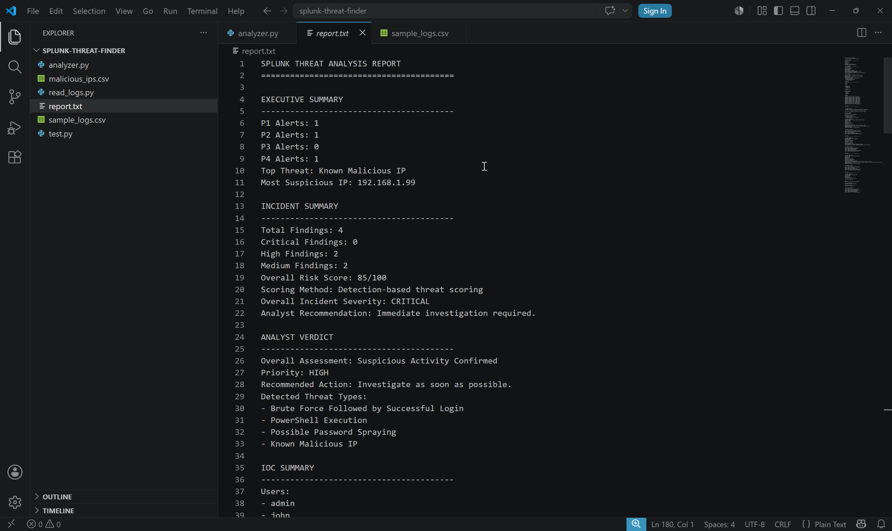
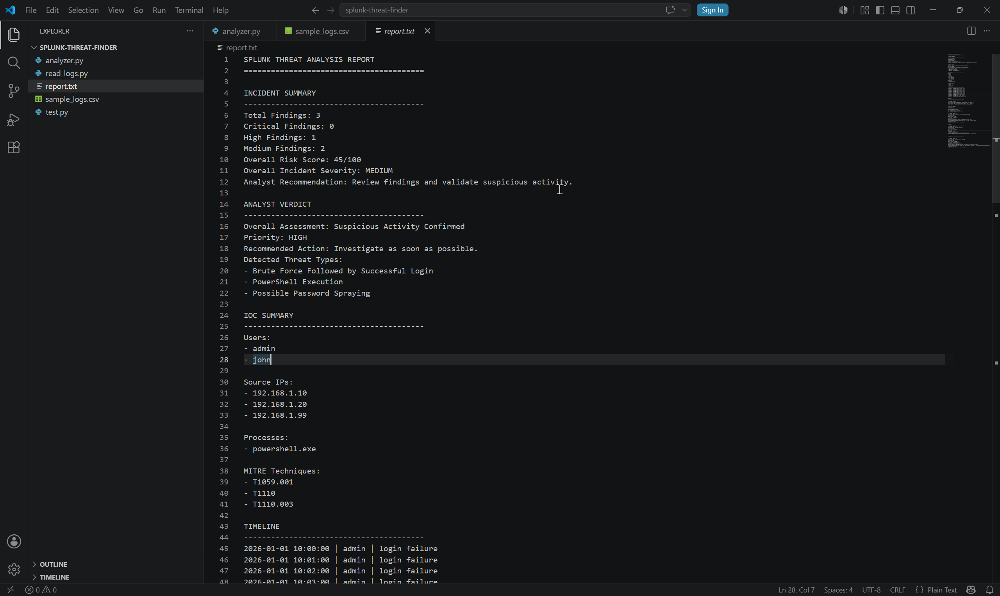
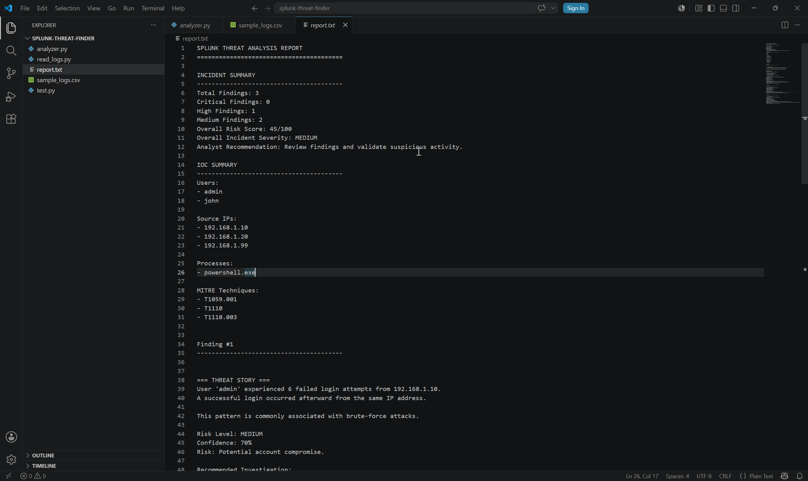

# Splunk Threat Finder v2.0

## Overview

Splunk Threat Finder is a Python-based cybersecurity threat analysis tool designed to detect suspicious activity from log data and generate analyst-friendly incident reports.

The project simulates Security Operations Center (SOC) workflows by identifying common attack techniques, extracting Indicators of Compromise (IOCs), mapping detections to MITRE ATT&CK techniques, and producing investigation guidance.

---

## Key Achievement

Developed a Python-based threat detection framework capable of identifying brute force attacks, password spraying, PowerShell execution, and malicious IP activity while generating SOC-style incident reports mapped to MITRE ATT&CK techniques.

## Features

### Threat Detection

* Brute Force Followed by Successful Login
* Password Spraying Detection
* PowerShell Execution Detection
* Known Malicious IP Detection

### Threat Analysis

* MITRE ATT&CK Mapping
* IOC Extraction
* Risk Scoring
* Severity Classification
* Priority Classification (P1–P4)

### Reporting

* Executive Summary
* Threat Statistics
* Severity Distribution
* Priority Distribution
* Analyst Verdict
* IOC Summary
* Timeline Reconstruction
* Investigation Playbooks

---

## MITRE ATT&CK Techniques

| Technique ID | Technique              |
| ------------ | ---------------------- |
| T1110        | Brute Force            |
| T1110.003    | Password Spraying      |
| T1059.001    | PowerShell             |
| T1047        | Windows Management Instrumentation (WMI)

---

## Sample Detections

### Brute Force Attack

The tool detects multiple failed login attempts followed by a successful login from the same IP address.

### Password Spraying

The tool identifies a single IP address attempting authentication against multiple user accounts.

### PowerShell Execution

The tool flags PowerShell execution events for analyst review.

### Known Malicious IP

The tool compares source IP addresses against a threat intelligence list and generates alerts for matches.

---

## Output Example

The generated report includes:

* Executive Summary
* Threat Statistics
* Severity Distribution
* Priority Distribution
* Incident Summary
* IOC Summary
* Timeline
* Threat Findings
* Investigation Playbooks

---

## Technologies Used

* Python
* CSV Log Analysis
* Splunk Enterprise
* SPL (Search Processing Language)
* MITRE ATT&CK Framework

---
## Skills Demonstrated

* Threat Hunting
* Security Monitoring
* Log Analysis
* Incident Investigation
* IOC Identification
* MITRE ATT&CK Mapping
* Splunk SPL Development
* Security Reporting
* Ransomware Analysis
* SOC Workflow Simulation

## Validation in Splunk

The detections were validated using Splunk Enterprise by:

* Importing sample log datasets
* Running SPL searches
* Reconstructing attack timelines
* Performing IOC analysis
* Investigating ransomware-style activity

---
## Threat Hunting Scenarios

### Scenario 1: Password Spraying Detection

**Objective:** Identify a single source IP attempting authentication against multiple user accounts.

**SPL Query**

```spl
source="sample_logs.csv" action="failure"
| stats dc(user) as unique_users values(user) as users by src_ip
| where unique_users >= 3
```

**Finding**

Source IP `192.168.1.99` generated failed login attempts against:

* alice
* bob
* charlie

This behavior is consistent with a password spraying attack.

---

### Scenario 2: PowerShell Execution Detection

**Objective:** Detect PowerShell activity that may indicate malicious execution.

**SPL Query**

```spl
source="sample_logs.csv" process="powershell.exe"
```

**Finding**

User `john` executed `powershell.exe` from source IP `192.168.1.20`.

PowerShell is commonly abused by attackers for post-exploitation activities.

---

### Scenario 3: Ransomware Activity Investigation

**Objective:** Reconstruct a ransomware execution chain.

**SPL Query**

```spl
source="ransomware_logs.csv"
| table timestamp process
```

**Observed Process Sequence**

1. powershell.exe
2. certutil.exe
3. vssadmin.exe
4. wmic.exe
5. rclone.exe
6. encrypted_files

**Finding**

The process sequence resembles common ransomware behavior involving payload download, shadow copy deletion, system discovery, data staging, and file encryption.

---

### Scenario 4: IOC Correlation

**Objective:** Correlate suspicious processes to affected hosts.

**SPL Query**

```spl
source="ransomware_logs.csv"
| stats values(process) as processes by src_ip
```
## Detection Logic

### Brute Force Detection
- Detects 5+ failed logins followed by a successful login.
- Maps to MITRE ATT&CK T1110.

### Password Spraying Detection
- Detects one IP attempting authentication against multiple users.
- Maps to MITRE ATT&CK T1110.003.

### PowerShell Execution Detection
- Detects suspicious PowerShell activity.
- Maps to MITRE ATT&CK T1059.001.

### Malicious IP Detection
- Correlates source IPs against known malicious indicators.
  
**Finding**

Host `192.168.1.50` executed multiple suspicious processes associated with ransomware activity and was identified as the affected system.

## Future Improvements

* HTML Dashboard Reporting
* Windows Event Log Support
* Automated Splunk Alert Generation
* Threat Intelligence API Integration
* Advanced Behavioral Analytics
* Sigma Rule Support
* Elastic SIEM Integration
---

## Architecture

```text
Log Files (CSV)
        ↓
Python Parser
        ↓
Threat Detection Engine
        ↓
MITRE ATT&CK Mapping
        ↓
IOC Extraction
        ↓
Risk Scoring
        ↓
Report Generation
        ↓
Splunk Validation
```

## Installation

git clone https://github.com/Suga-thamil/splunk-threat-finder.git

cd splunk-threat-finder

python analyzer.py

## Screenshots

### Executive Summary



### Analyst Verdict



### IOC Summary



## Author

Cybersecurity Portfolio Project

Built to demonstrate SOC operations, threat hunting, incident investigation, Splunk analysis, and MITRE ATT&CK mapping.


